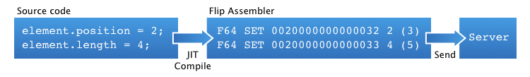
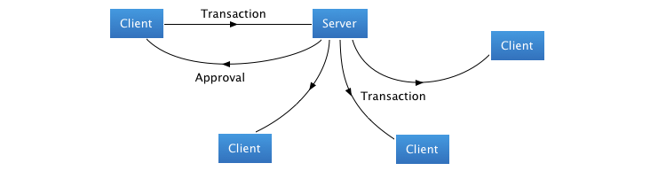

<p><sup><a href="about.md">previous</a> | <a href="model.md">next</a></sup></p>

<h1>How it Works</h1>

<h2 id="build">Building a Transaction</h2>

<p>The client of the Flip framework will directly modify the model by either:</p>

<ul>
<li>modifying a value by assigning it</li>
<li>insert, move or erase an object in a container</li>
</ul>

<p><center></center></p>

<p>Assigning a value is done with the <code>operator =</code> and modifying a container follows the same kind of prototypes as found in the standard library  (<code>insert</code>, <code>erase</code>, etc.) which makes the use of Flip quite natural.</p>

<p>In the background, each operation is translated in real-time in a simple assembler. When the client manipulates the model, Flip will apply and record all the changes made to the model and will make a program in this assembler language.</p>

<p>This program is also a transaction in the sense that applying a transaction will transform the model from a valid state to another valid state.</p>

<h2 id="validation">Validation</h2>

<p>This transaction is then sent to the server. The server interprets the assembler and makes changes to its own model. The transaction is then validated by the server. Validation ensures that the model is consistent and is done in two steps:</p>

<ol>
<li>structural validation</li>
<li>logical validation</li>
</ol>

<p><center></center></p>

<h3 id="validation-structural">Structural Validation</h3>

<p>Structural validation is handled by Flip. It ensures that an object can be either modified, inserted or erased. For example, structural validation may fail if two clients try to erase an object concurrently. In this case, the second transaction is rejected. Another example of this is where a client tries to change the value of an object that was erased concurrently, in which case the transaction would also be rejected.</p>

<h3 id="validation-logical">Logical Validation</h3>

<p>Logical validation is handled by the client. It ensures that the model is consistent relative to the meaning that the client assigned to the model's structure. For example, the client might have a container which represents the length. The client must then ensure that an element's position and length do not exceed the container's length:</p>

```c++
element._position + element._length <= container._length
0 <= element._position
0 <= element._length
0 <= container._length
```

<p><center></center></p>

<p>This kind of validation is possible in Flip, as it is dynamic (it is a program that the client writes) rather than static or semi-static (like an XML/DTD document).</p>

<p>The architecture of Flip allows one to write validators very quickly and in a tree-parsing fashion.</p>

<h2 id="approval">Validation Approval</h2>

<p><center></center></p>

<p>If the two-stage validation passes, the transaction is considered to be accepted. The server will broadcast the transaction to be executed by other clients, and will also send an approval message to the original client.</p>

<h2 id="refusal">Validation Refusal</h2>

<p><center></center></p>

<p>If the two-stage validation fails, the transaction is considered to be refused. The server will send a disapproval message to the original client, which rolls back the transaction.</p>

<p>When another client executes the transaction, it will make all the changes needed by that transaction. When it is done and succesfully applied, the client's observers are called.</p>

<p><sup><a href="about.md">previous</a> | <a href="model.md">next</a></sup></p>

