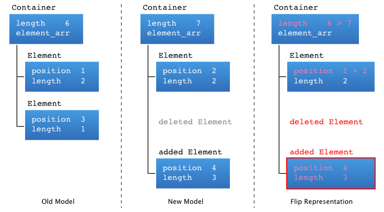

<p><sup><a href="how.md">previous</a> | <a href="undo.md">next</a></sup></p>

<h1>Interfacing with the Model</h1>

<p>When interfacing with the model, the code can be separated in two parts :</p>

<ol>
<li>the part that control the model</li>
<li>the part that reacts to model changes</li>
</ol>

<h2 id="control">Controlling the Model</h2>

<p>Controlling the model is done by directly changing the model as you would think with regular classes.</p>

<p>If a class <code>Element</code> has two members <code>position</code> and <code>length</code>, changing the position and the length of the element is as simple as :</p>

```c++
element.position = some_position;
element.length = some_length;
```

<p>The members used in classes, are actually Flip classes object. They are proxies that will handle the change to the model.</p>

<p>For example if you would write a class with a member :</p>

```c++
int	position;
```

<p>You would transform it to :</p>

```c++
flip::Int64	position;
```

<p>And if you would write a class with a member :</p>

```c++
std::list <Element>	element_arr;
```

<p>You would transform it to :</p>

```c++
flip::Array <Element>	element_arr;
```

<p>Manipulating the Flip containers is close to the standard library naming. Adding an element is done through <code>insert</code> and erasing an element is done through <code>erase</code>. Others functions are provided in a quite monolithic way like in the original standard to ensure that client using already the standard library will feel like just at home.</p>

<h2 id="view">Observing the Model</h2>

<p>When a client modify its own model or receive a modification (transaction) of the model from another client through the server, the model is directly modified.</p>

<p>The client of the model will have registered one or multiple observers to observer how the model is modified.</p>

<p>The client observer is then called with the model root object as a parameter.</p>

<p>When the client observer is called, Flip maintains the previous version of the model as well as the current one as applied by the transaction. This allows to know :</p>

<ul>
<li>exactly which objects where modified</li>
<li>the value of an object before of a modification</li>
<li>what was inserted/erased from a container</li>
<li>what was moved from a container to another</li>
</ul>

<p><center></center></p>

<p>The client is then responsible to parse the model tree to ensure that its local representation of the model match the one from Flip.</p>

<p>Furthermore, Flip was designed to make this task as simple as possible :</p>

<ul>
<li>the model tree can be parsed in any direction, parsed multiple times, etc.</li>
<li>one or multiple represented objects can be attached to Flip objects</li>
<li>we made up a few pattern of code to simplify your work</li>
</ul>

<p>As long as the model client does not exit from the observer call, Flip still maintains the old and current version of the model. Each flip object as well as your custom classes have an <code>added ()</code> member to know if an object or its compound contains a modification, and this recursively.</p>

<p>Whenether your local model uses object pointers, references or ids, you can attach it to any flip object. This also itself a best case interoperability with your external libraries or your GUI in a very simple way.</p>

<p><sup><a href="how.md">previous</a> | <a href="undo.md">next</a></sup></p>

