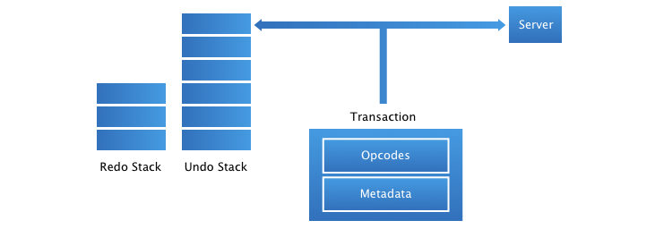

<a href="model.md">previous</a> | <a href="thread.md">next</a>

<h1>Undo/Redo System</h1>

With its program/transaction system, handling undo/redo or history with Flip is simple as giving a name (or any metadata) to a transaction.

Flip will then replay the transaction in its reversed way (undo) or in it original way (redo). In the case where a transaction would fail structural validation, Flip will modify the transaction so that it can be replayed.

Therefore, clients do not need to code “action classes” or anything similar for every single action on the model. The only thing to do is to describe what metadata the client want to attach to a transaction (generally a string describing the name of the action).

When the client calls <code>undo ()</code> or <code>redo ()</code> on the document history, the exact same code path is used. The transaction or its inverse is sent to the server, and the observers are called to allow further examination of the model change.

<a href="model.md">previous</a> | <a href="thread.md">next</a>

